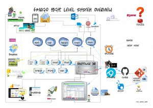

 

## Principles we follow

### Numero Uno

Our primary principle is to work as a team to deliver the best outcomes for the business.

### Transparency

We combine face to face and verbal communcation with individual focus and use tools such as Slack, Trello, and GitHub to communicate openly within a project, within our team, and publicly.

### Honesty

While we are considerate of people's feelings and opinions, we cannot let those concerns get in the way of getting the right outcome for the business and the success of our work. We'd rather be too honest than too polite.

### Trust

Our standards are very high, and bringing on a new team member requires a "yes" from everyone who participated in the interview process. Therefore, we expect the best from each other, give each other the benefit of the doubt, and encourage each other to take initiative to improve ourselves to improve my contribution to the team and the company.

### Continuous Improvement

We recognize that we can always be better. Therefore, we have strong opinions, loosely held, and take initiative to improve ourselves, the company, and our community. We are proponents of the [Agile manifesto](http://agilemanifesto.org/principles.html)

## Time

We work at a [sustainable pace](http://www.extremeprogramming.org/rules/overtime.html). We work four days for the business and one day on "investment time." We typically spend Monday-Thursday on business work and Friday on investment.

We believe in working wherever and whenever we work best. Because we rely on each other we confirm if we cannot meet a commitment, including letting our team members know if we cannot get to the office.

We know face to face communcation with our team is paramount & commit to spending at least 3 days in the office per week for conversation.

When taking time off during work, we discuss how it will impact the schedule with other team members.

**We communicate when and where we work to our team through Slack.**

### Investment

Investment time is time for investment in ourselves, our company, and our community. Primarily this means doing something that interests us like building tools for our team, contributing to open source, researching & presenting on a topic, attending community events, or just improving the workplace zen. The goal is to encourage individuals to improve and share their knowledge with the rest of the team.

We organize our investment work on the ["Team Time" Trello board.](https://trello.com/b/PSuyMLdb/team-time)

* * *

## Planning together

One of our primary process goals is to make [frequent, small releases](http://www.extremeprogramming.org/rules/releaseoften.html) of our working software.

This section describes how we achieve one week's worth of iteration on a product. It lays out the process we follow and some communication tactics.

### Agile Standups

Being a virtual team we use [tatsu.io](https://tatsu.io/) to do our onlines 'standups'

We mention what we are doing. And how we can make things more awesome.

We do this in order to:

- Communicate what we are doing
- Learn what others are doing so you can help them.
- Build accountability and trust.

#### Work hours

We try to have 4-6 hours in the work day that overlap for synchronous communication.

For some people, it is sometimes difficult to disengage from work when working at home. Also, flexible hours means that sometime one may work non-traditional hours in the day. We should be conscious to keep to a sustainable pace and take a break away from work.

* * *

## Measuring for improvement

> What gets measured gets done

We measure ourselves using the following metrics

- On-Time Delivery
- Product Quality
- Customer/User Satisfaction
- Business Value

* * *

## Developing with standards

### Code Reviews

Here's the flow. Read [our git protocol](https://github.com/thoughtbot/guides/tree/master/protocol) for the git commands.

1. Create a local feature branch based off master.
2. When feature is complete and tests pass, stage the changes.
3. When you've staged the changes, commit them.
4. Write a [good commit message](http://robots.thoughtbot.com/5-useful-tips-for-a-better-commit-message).
5. Share your branch.
6. Submit a [GitHub pull request](https://help.github.com/articles/using-pull-requests/).
7. Ask for a code review in [Slack](https://slack.com/).
8. A team member other than the author reviews the pull request. They follow [Code Review](https://github.com/thoughtbot/guides/blob/master/code-review) guidelines to avoid miscommunication.
9. They make comments and ask questions directly on lines of code in the GitHub web interface or in Slack.
10. When satisfied, they comment on the pull request "Ready to merge."
11. Rebase interactively. Squash commits like "Fix whitespace" into one or a small number of valuable commit(s). Edit commit messages to reveal intent.
12. View a list of new commits. View changed files. Merge branch into master.
13. Delete your remote feature branch.
14. Delete your local feature branch.

Test-Driven Development moves code failure earlier in the development process. It's better to have a failing test on your development machine than in production. It also allows you to have tighter feedback cycles.

Code reviews that happen right before code goes into master offer similar benefits:

- The whole team learns about new code as it is written.
- Mistakes are caught earlier.
- Coding standards are more likely to be established, discussed, and followed.
- Feedback from this style of code review is far more likely to be applied.
- No one forgets context ("Why did we write this?") since it's fresh in the author's mind.

### Continuous Integration

Martin Fowler has an [extensive description](http://martinfowler.com/articles/continuousIntegration.html) of Continuous Integration. The basics are:

- We have a test suite that each developer runs on their own machine.
- When they commit their code to a shared version control repository, the tests are run again, "integrated" with code from other developers.

This helps ensure there's nothing specific to the developer's machine making the tests pass. The code in version control needs to run cleanly in production later so before the code is allowed to be deployed to production, it is run on a CI server or service.

When a build fails, we get alerts in Slack and via email. Click the alert and we see a backtrace that gives us a hint of how to "fix the build."

When we write the fix and commit to version control again, we'll get a "passing build" alert in Slack and via email. Click the alert and we see the passing build.

Green is good.

A solid test suite is an absolute requirement for a web application in our opinion. However, one major problem with test suites is that they get slow as they get large.

CI can ease the pain by distributing the test runs in parallel. We've had 45 minute test suites cut down to 2 minutes using this technique.

We've used CruiseControl, Team City, TFS and other CI platforms/libraries that we manage ourselves. This resulted in many hours of expensive attention.

We use [AppVeyor](https://www.appveyor.com/)

CI test runs are triggered by [GitHub post-receive hooks](https://help.github.com/articles/post-receive-hooks). The hooks we have on most of our GitHub repos are:

## Production

We live in a magical modern era where many problems have already been solved for us. We focus on the core product as much as possible and outsource operations as much as possible to external services.

This saves time and money. We can get started using those services in minutes, and pay a service tens or hundreds of dollars per month instead of paying developers thousands or tens of thousands.

**Our Tech Overview**

[]https://raw.githubusercontent.com/chrismckelt/chrismckelt.github.io/master/_posts/posts/images//2014/02/SystemOverview.jpg)
