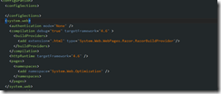
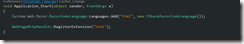
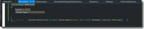

1\. Add the _buildProvider_ config for razor inside the compilation element

2\. Application start –> Registers the html extension with razor

3\. Create a Start.cshtml page and ingest the index.html page

<compilation debug\="true" targetFramework\="4.6" \> <buildProviders\> <add extension\=".html" type\="System.Web.WebPages.Razor.RazorBuildProvider"/> </buildProviders\> </compilation\> System.Web.Razor.RazorCodeLanguage.Languages.Add("html", new CSharpRazorCodeLanguage()); WebPageHttpHandler.RegisterExtension("html");

@using Fasti.WebClient @{ Layout \= null; @RenderPage("~/index.html") } <!-- Version + @System.Reflection.Assembly.GetAssembly(typeof (Startup)).GetName().Version.ToString(); \-->
