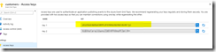
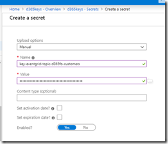
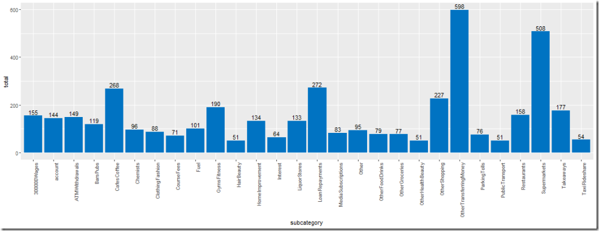
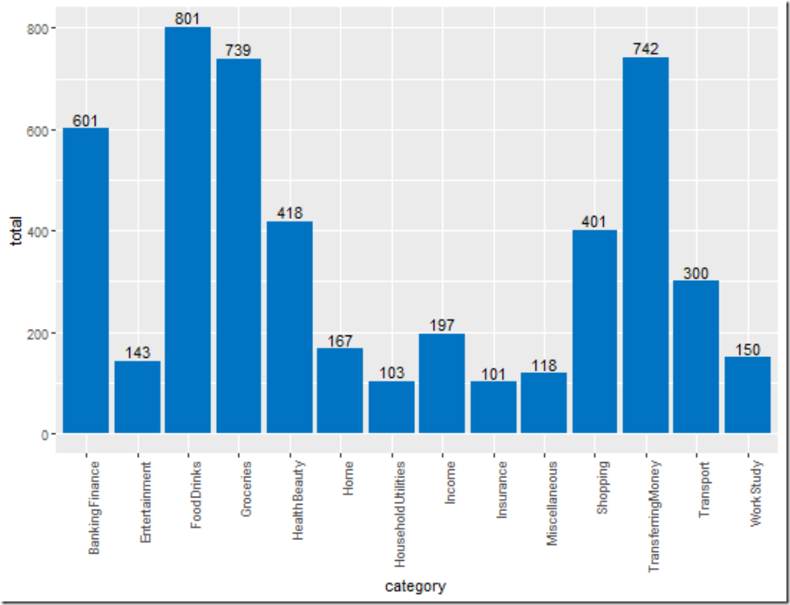
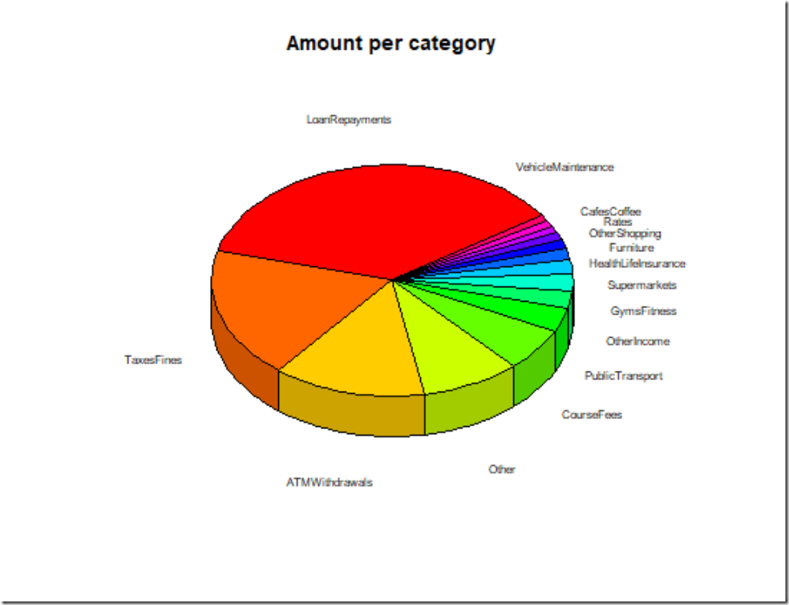

## So what are we trying to do here?

### Hypothesis

Given a users bank statement we will be able to predict (within a statistical confidence level ) the transactions within a period into [categories & sub categories](https://github.com/chrismckelt/vita/blob/master/source/Vita.Contracts/SubCategories/Categories.cs) for spending classification.

### Target Categories

- Banking & Finance
- Entertainment
- Food & Drinks
- Groceries
- Health & Beauty
- Holiday & Travel
- Home
- Household Utilities
- Income
- Insurance
- Kids
- Miscellaneous
- Shopping
- Transferring Money
- Transport
- Work & Study

[Sub categories available on this link](https://github.com/chrismckelt/vita/blob/master/source/Vita.Contracts/SubCategories/Categories.cs)

## So what does a bank statement usually contain?

#### Account Summary

#### Account Statement

#### Account Transactions

Account types come in numerous varieties of credit/debit [options](http://echeck.org/ultimate-guide-to-the-different-types-of-bank-accounts/).

## What data are we trying to predict?

Each transaction will contain at least 3 lines which can be used for **categorisation** prediction.

- Transaction date
- Transaction line description
- Amount

We want to know whether the payment was debit/credit and for what reason. So we can analyse our/the consumers financial decisions overtime.   Not all categories will be easy.  Random text entered by the vendor can stop a transaction type being identified easily.

But there are other ways to predict what that type of transaction would be. For example, given an unclassified transaction (not recognisable by keywords such as café, food, bar) occurred on a Saturday night between 5-10pm with the amount > 20 and under 500 the algorithm will look at past consumer payments at this time period and see most common categories at this time are food/restaurants/bars. PS let me know if you spend close to $500 on a bar bill – I think I want to party with you!

From this we are looking to summate the transactions for each sub category into their parent group.

Below is a result of **_manually_** classifying 3 months worth of bank statements into assigned categories.

_Sample of Subcategories having > 50 occurrences on a bank statement_

### Each sub-category rolls up into its parent category which gives a clearer view on where money is coming/going:

_Total categories summed by subcategory_

  

### Summing the amount for each of these categories will give us the total income/expenditure.

  

  

* * *

  

## Posts in this series

[Charge Id – scratching the tech itch \[ part 1 \]](/blog/?p=460)  
[Charge Id – lean canvas \[ part 2 \]](/blog/?p=485)  
[Charge Id – solution overview \[ part 3 \]](/blog/?p=505)  
[Charge Id – analysing the data \[ part 4 \]](/blog/?p=507)  
[Charge Id – the prediction model \[ part 5 \]](/blog/?p=668)  
[Charge Id – deploying a ML.Net Model to Azure \[ part 6 \]](/blog/?p=705)

  

## Code

[https://github.com/chrismckelt/vita](https://github.com/chrismckelt/vita "https://github.com/chrismckelt/vita")
