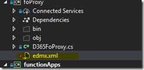

## To create the D365 FinOps C# OData Proxy do:

1\. Install the following plugin

[https://marketplace.visualstudio.com/items?itemName=Unchase.unchaseodataconnectedservice](https://marketplace.visualstudio.com/items?itemName=Unchase.unchaseodataconnectedservice)

2\. Using a Visual Studio Standard Library project and add a new ‘Connected Service’

[![clip_image001[4]](images/clip_image0014_thumb.png "clip_image001[4]")](https://raw.githubusercontent.com/chrismckelt/chrismckelt.github.io/master/_posts/posts/images2019/12/clip_image0014.png)

[![clip_image002[4]](images/clip_image0024_thumb.png "clip_image002[4]")](https://raw.githubusercontent.com/chrismckelt/chrismckelt.github.io/master/_posts/posts/images2019/12/clip_image0024.png)

3\. Open the _Reference.cs_  file in VS Code (_VS Code seems to handle the file better than Notepad++ and Visual Studio)_

4.  Search for the EDMX mega string in the file

_private const string Edmx  = @”\[mega big xml string we need to change\]”_

5.   Cut the EDMX mega string and place in a file on disk call _edmx.xml_  on disk.  Change  "" to "

Set this to be file to be embedded content in your Visual Studio project

5\. Search for the below function name and replace with the code below:

6\. Now create your own proxy wrapper with authentication using:

7\. Sample unit test to create a sales order

