### Overview on how to publish data entity changes from Dynamics Finance and Operations to Azure Event Grid.

### Step 1

In D365FO, Navigate to the Business Events Catalogue page

[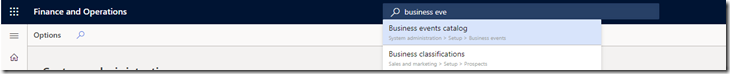](http://blog.mckelt.com/wp-content/uploads/2019/10/image.png)

### Step 2

Navigate to the _endpoints_ tab and select ‘Azure Event Grid’

[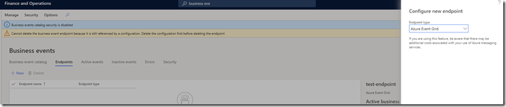](http://blog.mckelt.com/wp-content/uploads/2019/10/image-1.png)

### Step 3

In Azure, create an application service registration

[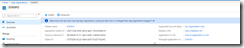](http://blog.mckelt.com/wp-content/uploads/2019/10/image-2.png)

_Take note of the Application Id and the Secret Id_

### Step 4

In Azure,  create an Azure Event Grid Topic

[https://customers.westus2-1.eventgrid.azure.net/api/events](https://customers.westus2-1.eventgrid.azure.net/api/events)

Copy the Access Key

[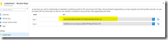](http://blog.mckelt.com/wp-content/uploads/2019/10/image-3.png)

### Step 5

In Azure,  create an Azure Key Vault with a key called

key-eventgrid-topic-d365fo-customers

[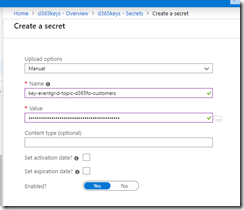](http://blog.mckelt.com/wp-content/uploads/2019/10/image-4.png)

The secret value is the Access Key for the Event Grid Topic

### Step 6

On the key vault – grant access to the secret for the Application Registration

[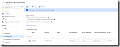](http://blog.mckelt.com/wp-content/uploads/2019/10/image-5.png)

[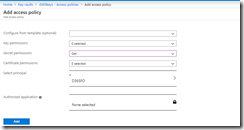](http://blog.mckelt.com/wp-content/uploads/2019/10/image-6.png)

### Step 7

In D365FO ‘configure an endpoint’ and enter the Azure Event Grid Topic endpoint

It now requires the Application Id & Application secret + the key vault name + name of secret in key vault (to get the Access Key)

[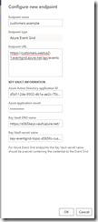](http://blog.mckelt.com/wp-content/uploads/2019/10/image-7.png)

### Step 8

An endpoint should now display

[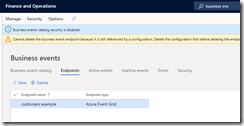](http://blog.mckelt.com/wp-content/uploads/2019/10/image-8.png)

### Step 9

Activate the following 2 business events

- BusinessEventsAlertEvent
- BusinessEventsDueDateAlertEvent

[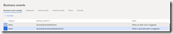](http://blog.mckelt.com/wp-content/uploads/2019/10/image-9.png)

select your newly created endpoint

### Step 10

From the customers list, create a custom alert

[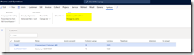](http://blog.mckelt.com/wp-content/uploads/2019/10/image-10.png)

Configure the alert to happen when the record is created, deleted or a field changes

[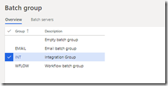](http://blog.mckelt.com/wp-content/uploads/2019/10/image-11.png)

[Ensure ‘Send Externally’ is true](https://docs.microsoft.com/en-us/dynamics365/fin-ops-core/dev-itpro/business-events/alerts-business-events)

### Step 11

Edit the customer and change the field with the alert on it & save the record

### Step 12

view an alert & business event arrives in the following table

[https://XXXXX.dynamics.com/Default.htm?mi=SysTableBrowser&cmp=YYYY&tablename=eventcud](https://XXXXX.dynamics.com/Default.htm?mi=SysTableBrowser&cmp=YYYY&tablename=eventcud "https://clubassist-sand02.sandbox.operations.dynamics.com/Default.htm?mi=SysTableBrowser&cmp=usmf&tablename=eventcud")

XXXXX == your organisations URL  
YYYY == your company

[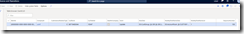](http://blog.mckelt.com/wp-content/uploads/2019/10/image-14.png)

if no record appears here – you might need to fix your batch jobs

### Step 13

Verify that your Azure Event Grid Topic has received the customer change events

[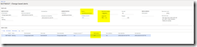](http://blog.mckelt.com/wp-content/uploads/2019/10/image-12.png)

### Step 14

The below payload structure is sent to Event Grid

[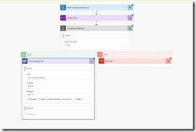](http://blog.mckelt.com/wp-content/uploads/2019/10/image-13.png)

# Subscribing to published Events in Flow

[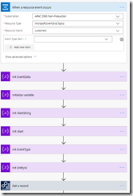](http://blog.mckelt.com/wp-content/uploads/2019/10/image-15.png)

## Sample extract (which was pushed to teams)

- ID = BULK-002
- Event = LocationChanged
- Payload = {"BusinessEventId":"BusinessEventsAlertEvent","ControlNumber":5637145330,"Email":"Chris.McKelt@xxx.com.au","EventId":"D60A8657-E87C-43A8-8D7D-826EBF0490D7","EventTime":"/Date(1570769681000)/","FieldId":3,"Link":"","MajorVersion":0,"Message":"LocationChanged","MessageDetails":"View Location: BULK-002, 24","MinorVersion":0,"ParentTableId":8565,"RuleId":"000428","Subject":"LocationChanged","TableId":8565,"TypeTrigger":"FieldChanged","UserId":"Chris.McKelt"}

Key Points for setting up change alerts in D365 FO

1. Alerts should be setup under 1 user with admin permissions (on test this is the dual write user)
2. Setup  a Batch Group called INT (integration) and allocate servers to it
3. 
4.    Ensure the Batch Job is setup as below (note the user) 

## Exported Logic App / Flow Example to listen to events and send to Teams channel

