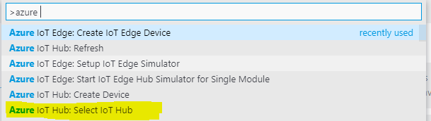
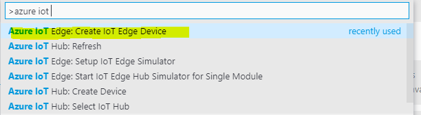
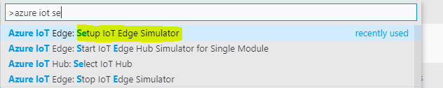
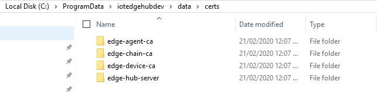
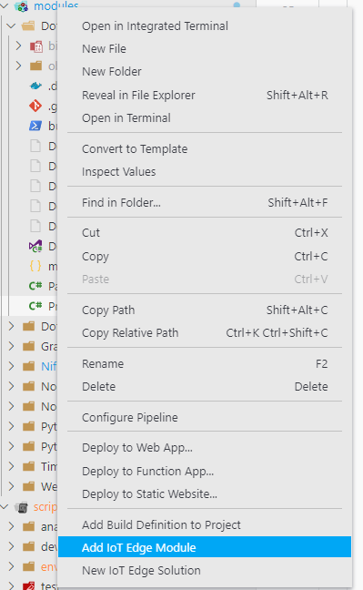
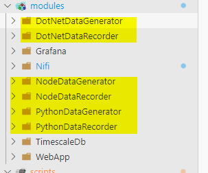
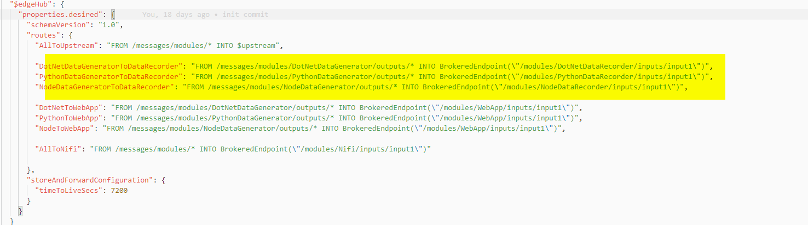
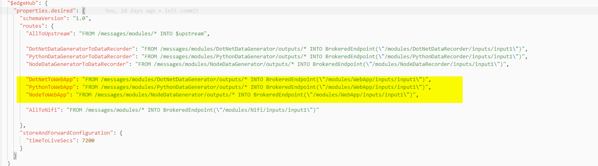
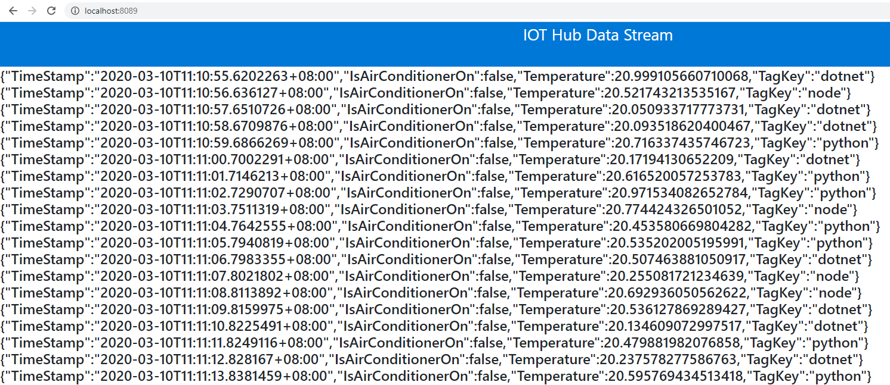

# Series

[Part 1 - dotnet vs python vs node - temperature emission - who is cooler?](https://dev.to/chris_mckelt/azure-iot-edge-who-is-cooler-dotnet-node-or-python-369m)  
[Part 2 - Developing modules](https://dev.to/chris_mckelt/azure-iot-edge-developing-custom-modules-df3)  
[Part 3 - Custom Containers using Apache Nifi](https://dev.to/chris_mckelt/azure-iot-edge-3rd-party-containers-3mi3)  
[Part 4 - Custom Module using TimescaleDB](https://dev.to/chris_mckelt/azure-iot-edge-using-timescaledb-on-the-edge-2ec1)  
[Part 5 - Custom Module using Grafana](https://dev.to/chris_mckelt/azure-iot-edge-using-grafana-on-the-edge-26na)

  

# Intro

This is part 2 in a series starting [here](http://blog.mckelt.com/2020/02/13/azure-iot-edge-creating-an-edge-reporting-solution/) running through an Azure IoT Edge demo solution located at: [https://github.com/chrismckelt/edgy](https://github.com/chrismckelt/edgy)

This part will cover developing and running custom modules written in C#, Python and NodeJS.

It will focus on commands available in the VS Code interface rather than command line arguments as seen at: [https://aka.ms/iotedgedev](https://aka.ms/iotedgedev)

## Azure IoT SDKs

Azure IoT Edge has a number of [SDKs](https://github.com/Azure/azure-iot-sdks) for module development in your favourite language.  The [SDK code](https://github.com/Azure/azure-iot-sdks) will handle setting up environment variables and provide the boiler plate code necessary to send and receive messages using multiple [protocols & channels  (e.g. MQTT, AMQP)](https://docs.microsoft.com/en-us/azure/iot-hub/iot-hub-devguide-protocols)

## [Setting up VS Code to run the local simulator](https://docs.microsoft.com/en-us/azure/iot-hub/iot-hub-devguide-protocols)

Given the solution is cloned locally and Azure is setup with our IOT Hub we can configure a device to act as a local simulator.

1\. Select IOT Hub & choose your IOT Hub

2\. Create IOT Edge Device - I have named my local device ‘_LocalSimulator_ ‘

3\. Setup IOT Edge Simulator – this will create you edge certs

This will generate and install certificates for local development in the following folder & also install the for you _note://run VS Code as admin for this_

## Creating a module for our solution

Right click on the modules folder and select ‘Add IoT Edge Module’.

This will then ask a module name & language (C,C#,Java,Node.js, Python)

I have created numerous custom modules for this solution. For this post we focus on the below 6

## Data Generators

The demo code shows 3 ‘data generator’ modules written in C#, Python & Node JS.

Each module publishes a message every second simulating temperature capture.  Properties of the sent message are:

In C# connecting to the Edge Hub and sending messages can be seen in the following code:

## Data Recorders

3 modules in matching languages subscribe to their respective modules published messages

Messages received are deserialized from JSON format to a POCO and then saved in a database.

## Routes

In order to route messages between modules we use the inbuilt route system in our [deployment template](https://github.com/chrismckelt/edgy/blob/master/deployment.debug.template.json) file.

## Web App – Viewer module

Finally to view the messages from a web page I have modified an [existing demo to](https://github.com/Azure-Samples/iot-edge-hmi-module) that uses SignalR view all messages sent to it from the below routes:

When running the solution you can view all published messages on the web page below

## Outro

Here was a basic overview of an demo solution to create and build your own custom IoT Edge modules.

Next we will introduce an existing docker container ([https://nifi.apache.org/)](https://nifi.apache.org/)) to act as a data orchestrator. This will subscribe to all 'Payload' messages and publish a message to ‘turn off’ the air conditioner when the temperature is too high.
