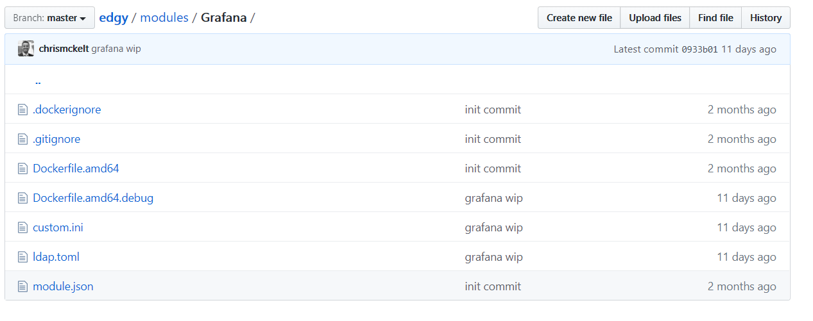
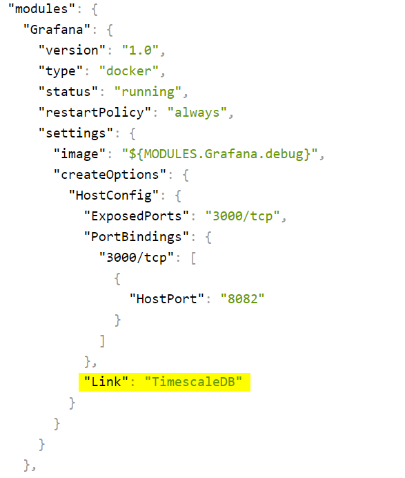
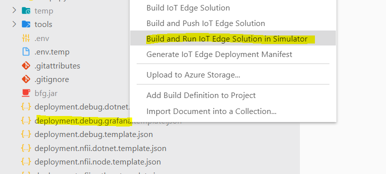
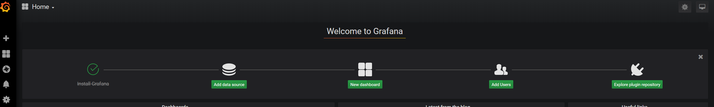
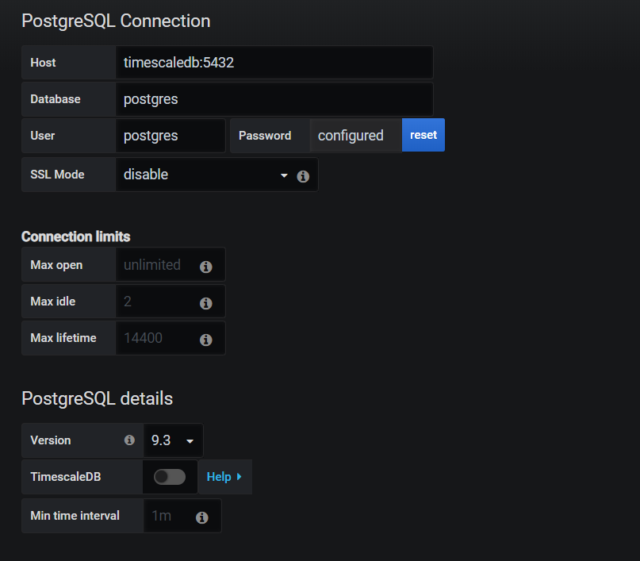
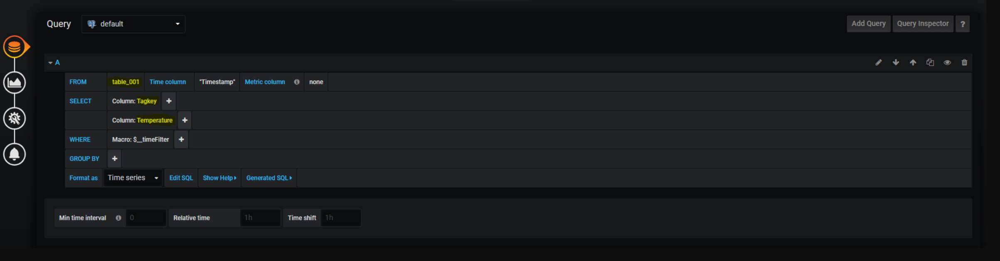
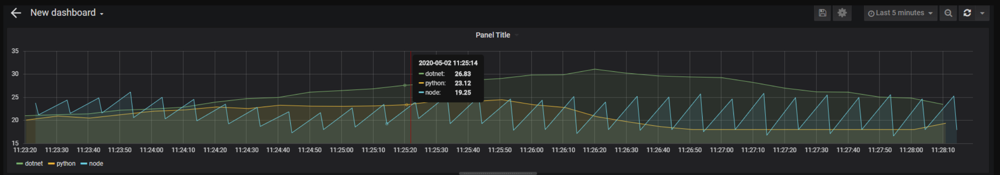

# Series

[Part 1 - dotnet vs python vs node - temperature emission - who is cooler?](https://dev.to/chris_mckelt/azure-iot-edge-who-is-cooler-dotnet-node-or-python-369m)  
[Part 2 - Developing modules](https://dev.to/chris_mckelt/azure-iot-edge-developing-custom-modules-df3)  
[Part 3 - Custom Containers using Apache Nifi](https://dev.to/chris_mckelt/azure-iot-edge-3rd-party-containers-3mi3)  
[Part 4 - Custom Module using TimescaleDB](https://dev.to/chris_mckelt/azure-iot-edge-using-timescaledb-on-the-edge-2ec1)  
[Part 5 - Custom Module using Grafana](https://dev.to/chris_mckelt/azure-iot-edge-using-grafana-on-the-edge-26na)

# Intro

This is part 5 in a series starting [here](https://dev.to/chris_mckelt/azure-iot-edge-who-is-cooler-dotnet-node-or-python-369m) that runs through building an [Azure IOT Edge](https://docs.microsoft.com/en-us/azure/iot-edge/about-iot-edge) solution. This post will run through setting up [Grafana](https://grafana.com/) to visualise temperature readings sent from the dot net, python and node custom edge modules.

The code is located at: [https://github.com/chrismckelt/edgy](https://github.com/chrismckelt/edgy)

> [Grafana](https://grafana.com/) is the open source analytics and monitoring solution for every database

## Steps to add the module

### 1\. add a new [custom module](https://github.com/chrismckelt/edgy/tree/master/modules/Grafana) 

### 2\. add a new [deployment file](https://github.com/chrismckelt/edgy/blob/master/deployment.debug.grafana.template.json) just for Grafana (and amend the [full solution file](https://github.com/chrismckelt/edgy/blob/master/deployment.debug.template.json))

### 3\. create the [docker file](https://github.com/chrismckelt/edgy/blob/master/modules/Grafana/Dockerfile.amd64.debug)

###### FROM grafana/grafana:latest

###### \# login with admin and below password to web interface

###### ENV GF\_SECURITY\_ADMIN\_PASSWORD \[_YOUR\_GRAFANA\_PASSWORD\_HERE\]_

###### ENV GF\_AUTH\_LDAP\_ENABLED=false

###### ENV GF\_DATABASE\_TYPE postgres

###### ENV GF\_DATABASE\_HOST timescaledb

###### ENV GF\_DATABASE\_NAME grafana

###### ENV GF\_DATABASE\_USER grafana

###### ENV GF\_DATABASE\_PASSWORD \[_YOUR\_DATABASE\_PASSWORD\_HERE\]_

###### COPY ldap.toml /etc/grafana/

###### COPY custom.ini /etc/grafana/

### 4\. create the [custom.ini](https://github.com/chrismckelt/edgy/blob/master/modules/Grafana/custom.ini)

make sure to enter the database password on line 75

### 5\. build and run IoT Edge solution in simulator

###### 

### 6\. Navigate to [http://localhost:8082/](http://localhost:8082/) and login (admin + your grafana password)

The Grafana setup board should appear as below

### 7\. Add data source –> PostgreSQL

  

### 8\. Add a dashboard query & set the query as below

A time series graph will display the 3 temperature readings over time.

# Outro

Here we have added Grafana to our IoT Edge solution and created a dashboard from the data stored in [TimescaleDB](https://www.timescale.com/). The generated temperature sent from the 3 modules is analysed by [Apache Nifi](https://dev.to/chris_mckelt/azure-iot-edge-3rd-party-containers-3mi3). When the temperature is greater than 25 degrees a request is sent back to the specific module to activate the air conditioner, which makes the temperature randomly decrease over time.

Think I would prefer the Python room as it appears the [coolest](https://user-images.githubusercontent.com/662868/80854122-2bf22b80-8c68-11ea-919c-4833ac0847b8.png)   
