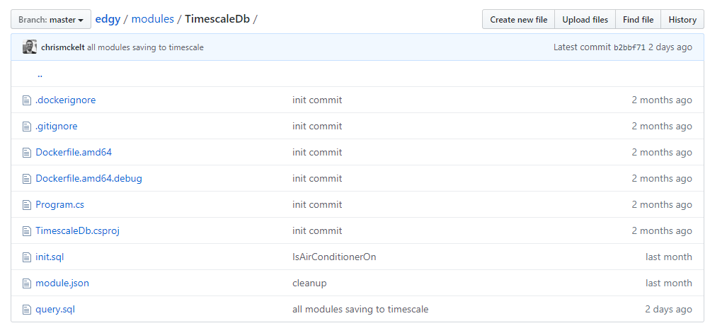
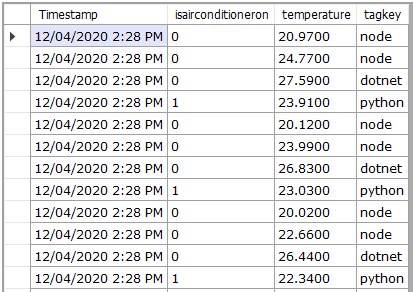

# Series

[Part 1 - dotnet vs python vs node - temperature emission - who is cooler?](https://dev.to/chris_mckelt/azure-iot-edge-who-is-cooler-dotnet-node-or-python-369m)  
[Part 2 - Developing modules](https://dev.to/chris_mckelt/azure-iot-edge-developing-custom-modules-df3)  
[Part 3 - Custom Containers using Apache Nifi](https://dev.to/chris_mckelt/azure-iot-edge-3rd-party-containers-3mi3)  
[Part 4 - Custom Module using TimescaleDB](https://dev.to/chris_mckelt/azure-iot-edge-using-timescaledb-on-the-edge-2ec1)  
[Part 5 - Custom Module using Grafana](https://dev.to/chris_mckelt/azure-iot-edge-using-grafana-on-the-edge-26na)

# Intro

This is part 4 in a series starting [here](https://dev.to/chris_mckelt/azure-iot-edge-who-is-cooler-dotnet-node-or-python-369m) that runs through building an [Azure IOT Edge](https://docs.microsoft.com/en-us/azure/iot-edge/about-iot-edge) solution. This post will run through setting up [TimescaleDB](https://www.timescale.com/) to store data published from the dotnet, python and node temperature modules.

The code is located at: [https://github.com/chrismckelt/edgy](https://github.com/chrismckelt/edgy)

> [TimescaleDB](https://www.timescale.com/): An open-source database built for analysing
> 
> time-series data with the power and convenience of
> 
> SQL — on premise, at the edge or in the cloud.

## Steps to add the database

### 1\. add the [custom module](https://github.com/chrismckelt/edgy/tree/master/modules/TimescaleDb) 

### 2\. add the section to the [deployment file](https://github.com/chrismckelt/edgy/blob/master/deployment.debug.template.json)

Expose the internal port 5432 that TimescaleDB uses to 8081 for external container use

### 3\. create the [docker file](https://github.com/chrismckelt/edgy/blob/master/modules/TimescaleDb/Dockerfile.amd64.debug)

### 4\. create the [database, login and schema](https://github.com/chrismckelt/edgy/blob/master/modules/TimescaleDb/init.sql)

### 5\. run the container and insert data from another module

######  select \* from "table\_001" where Isairconditioneron = 0 ORDER BY "Timestamp" DESC LIMIT 100;

# Outro

Now we have data being saved into the database we can move onto displaying it visually via [Grafana](https://grafana.com/) in the next post.
