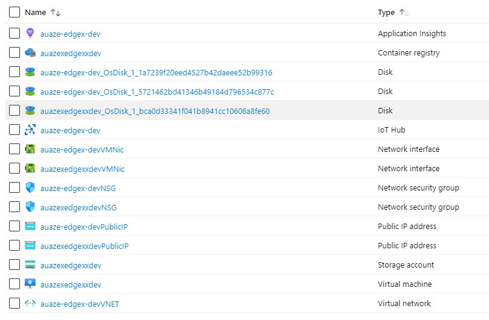
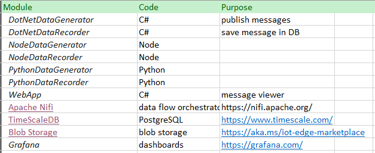
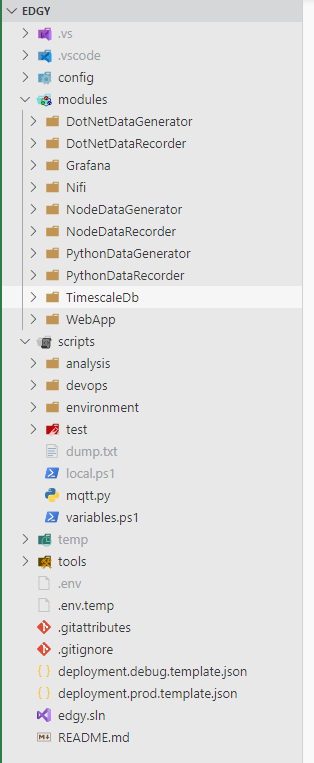
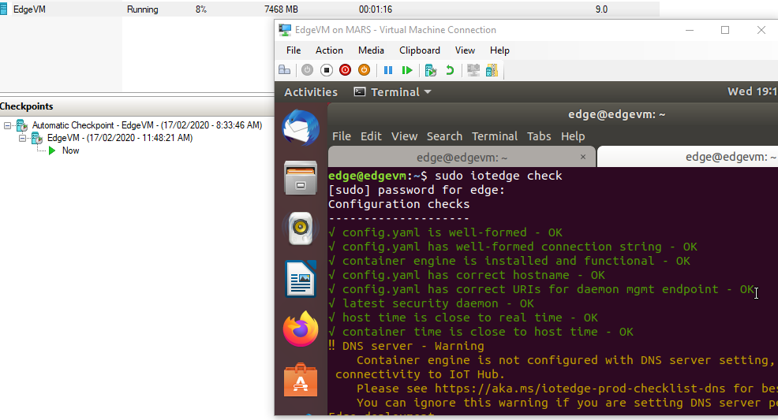
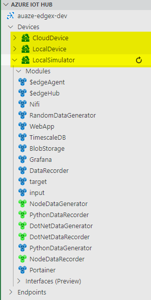

# Series

[Part 1 - dotnet vs python vs node - temperature emission - who is cooler?](https://dev.to/chris_mckelt/azure-iot-edge-who-is-cooler-dotnet-node-or-python-369m)  
[Part 2 - Developing modules](https://dev.to/chris_mckelt/azure-iot-edge-developing-custom-modules-df3)  
[Part 3 - Custom Containers using Apache Nifi](https://dev.to/chris_mckelt/azure-iot-edge-3rd-party-containers-3mi3)  
[Part 4 - Custom Module using TimescaleDB](https://dev.to/chris_mckelt/azure-iot-edge-using-timescaledb-on-the-edge-2ec1)  
[Part 5 - Custom Module using Grafana](https://dev.to/chris_mckelt/azure-iot-edge-using-grafana-on-the-edge-26na)

# Intro

This code will run through creating an end to end demo of building & deploying an [Azure IoT Edge solution](https://docs.microsoft.com/en-us/azure/iot-edge/about-iot-edge) solution.

Code for this example lives here

##### [https://github.com/chrismckelt/edgy](https://github.com/chrismckelt/edgy)

## What are we building?

This solution demonstrates an air-conditioning monitoring system where 3 room sensors are publishing their temperature over time.   When a room gets too hot the air conditioner for that room is turned on. Once the room is cooled it is turned off.

Three ‘data generator’ modules publish a message with the following properties.

- _Timestamp_ 
- _Temperature_ –   room temp in Celsius
- _IsAirConditionerOn_ – true/false
- _TagKey_ – room name (in this case  dotnet, node, python)

Three ‘data recorder’ modules subscribe to the published temperature messages and save the data in a time series database.

A custom module will listen to all temperature messages and analyse when a room is too hot. Sending a message to turn the rooms air conditioner on.

## Demo Focus Areas

1. show local debug/development options &  remote/real deployment
2. how to create and configure an Azure IOT Hub environment in Azure [using Azure CLI scripts](https://github.com/chrismckelt/edgy/tree/master/scripts/environment)
3. coding custom modules in .Net, Python, NodeJS (sorry Java)
4. using existing [Azure IoT Edge marketplace](https://aka.ms/iot-edge-marketplace) modules
5. using non-edge marketplace modules (docker images) to save data with [Timescale](https://www.timescale.com/)
6. connecting a data flow engine ( [Apache Nifi](https://nifi.apache.org/)) to the Edge [MQTT Broker](https://docs.microsoft.com/en-us/azure/iot-hub/iot-hub-mqtt-support)
7. viewing the data through a [Grafana](https://grafana.com/) dashboard.

# Getting started

In order to develop solutions for the edge:

1. Read [Developing custom modules](https://docs.microsoft.com/en-us/azure/iot-edge/how-to-vs-code-develop-module)
2. Setup your machine using the [Azure IoT EdgeHub Dev Tool](https://github.com/Azure/iotedgedev)
3. I recommend installing these [VS code extensions](https://marketplace.visualstudio.com/items?itemName=vsciot-vscode.azure-iot-edge)
4. I recommend using [Portainer](https://www.portainer.io/) for docker management both locally & on the deployed edge solution

###### Portainer running on [http://localhost:9000/](http://localhost:9000/)

* * *

## Solution Overview

## Azure Setup

You will need an [Azure IoT Hub](https://azure.microsoft.com/en-us/pricing/details/iot-hub/) setup in Azure.   For this demo I am using the free tier

> The IoT Hub Free Edition is intended to encourage proof of concept projects. It enables you to transmit up to a total of 8,000 messages per day, and register up to 500 device identities. The device identity limit is only present for the Free Edition.

To build the environment I have used the Azure CLI and created scripts found [here](https://github.com/chrismckelt/edgy/tree/master/scripts/environment).   Run the top 3 on your selected subscription to create the artefacts in Azure below:

Running

## Modules

The code contains the docker build files , code & scripts to create the following modules

## Code

#### Descriptions of folders and files

| Folder /  File | Description |
| --- | --- |
| config | automatically generate files from the deployment.templates.json (debug or prod) that are used to deploy the solution |
| modules | custom code, docker images for your IOT Edge solution |
| scripts | code to create the environment, build the code/docker images and deploy the solution |
| tools | certificate generator and other tools for solution support |
| .env | holds environment variables that populate the generated config files from the templates |
| deployment.debug.template.json |   creates a file in the /config folder called 'deployment.debug.json' that populates environment variables, used for local development |
| deployment.prod.template.json | creates a file in the /config folder called 'deployment.prod.json' that populates environment variables, used for production like deployment |

#### Solution Structure Overview

## Azure IOT Edge Devices

The solution used 3 devices which will be setup in a future post.

### 1\. Local Simulator

##### A simulated local environment using the [Azure IoT Edge Hub Development simulator to run against the IOT Hub.](https://github.com/Azure/iotedgehubdev)   When developing for the edge it is recommended not to install [the real ‘IOT edge runtime’](https://docs.microsoft.com/bs-latn-ba/Azure/iot-edge/how-to-install-iot-edge-linux) on your machine but instead use the simulator.

### 2\. Local Device

##### Linux Ubuntu machine hosted in VMWare on my local machine using Hyper V

[https://docs.microsoft.com/bs-latn-ba/Azure/iot-edge/how-to-install-iot-edge-linux](https://docs.microsoft.com/bs-latn-ba/Azure/iot-edge/how-to-install-iot-edge-linux)

### 3\. Cloud Device

##### Linux Ubuntu hosted on Azure in our resource group [created using this script](https://github.com/chrismckelt/edgy/blob/master/scripts/environment/init.ps1)

This uses the pre-existing [Linux Ubuntu image from the Azure Marketplace](https://azuremarketplace.microsoft.com/en-us/marketplace/apps/microsoft_iot_edge.iot_edge_vm_ubuntu?tab=overview)  with the runtime installed.

Once up and running VS Code will show the devices below.

  

# Outro

Now we have a view of the setup, development environment & code, we can move onto the next post [‘Developing custom modules for Azure IoT Edge’](http://blog.mckelt.com/2020/03/09/azure-iot-edge-developing-custom-modules/)
