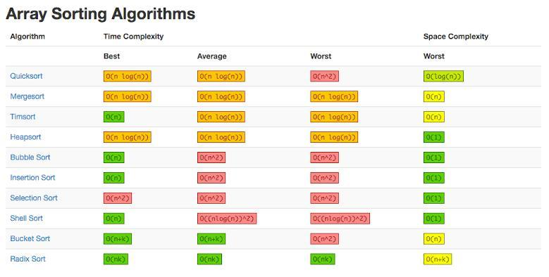

- Bubble
- Heap

- Insertion

- Merge

- Quick

- Selection

- Shell

# Which sorting algorithm has the best asymptotic runtime complexity?

Heap Sort

https://en.wikipedia.org/wiki/Sorting\_algorithm

 
