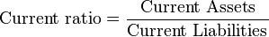
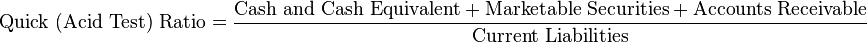

# Liquidity ratios

 

 

 

Cash ratio is the same as Quick without the accounts receivable

 

 

# Solvency ratios

 

Long term debt to equity =  total debt / total equity

 

Debt to equity = total debt / total equity

 

Total debt ratio = total debt / total assets

 

Financial leverage ratio = total assets / total equity
