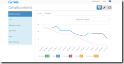
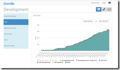
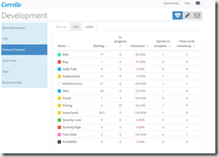
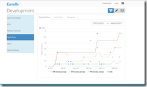
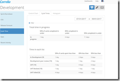
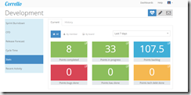
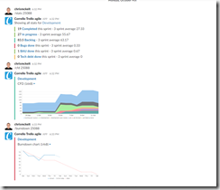

After initially using Trello with ‘[Scrum for Trello’](http://scrumfortrello.com)' to run our companies Agile process and having to manually create burn downs and release estimates with Excel ([after mangling data from the Trello API and a Google Spread sheet](https://gist.github.com/chrismckelt/a8a7fb7cbf768e1423eb5da15070daa7)) we moved to Trello with GetCorrello (and switched to Kanban after a few months with the teams consent)

Charts from this tool are below.   The GetCorrello team were able to add features on demand. Would use them again!

[https://getcorrello.com](https://getcorrello.com "https://getcorrello.com")

## Some samples

## Burndown

[]https://raw.githubusercontent.com/chrismckelt/chrismckelt.github.io/master/_posts/posts/images//2017/10/image.png)

## Cumulative Flow Diagram

[]https://raw.githubusercontent.com/chrismckelt/chrismckelt.github.io/master/_posts/posts/images//2017/10/image-1.png)

## Estimated time to complete per label

[]https://raw.githubusercontent.com/chrismckelt/chrismckelt.github.io/master/_posts/posts/images//2017/10/image-2.png)

## Control chart

[]https://raw.githubusercontent.com/chrismckelt/chrismckelt.github.io/master/_posts/posts/images//2017/10/image-3.png)

## Cycle times

[]https://raw.githubusercontent.com/chrismckelt/chrismckelt.github.io/master/_posts/posts/images//2017/10/image-4.png)

## Stats

[]https://raw.githubusercontent.com/chrismckelt/chrismckelt.github.io/master/_posts/posts/images//2017/10/image-5.png)

## Slack integration

[]https://raw.githubusercontent.com/chrismckelt/chrismckelt.github.io/master/_posts/posts/images//2017/10/image-6.png)

 

## Our Kanban process

[https://www.dropbox.com/s/fj1mr93gqhxv8nc/Fair%20Go%20Kanban%20Process.pptx?dl=0](https://www.dropbox.com/s/fj1mr93gqhxv8nc/Fair%20Go%20Kanban%20Process.pptx?dl=0 "https://www.dropbox.com/s/fj1mr93gqhxv8nc/Fair%20Go%20Kanban%20Process.pptx?dl=0")
