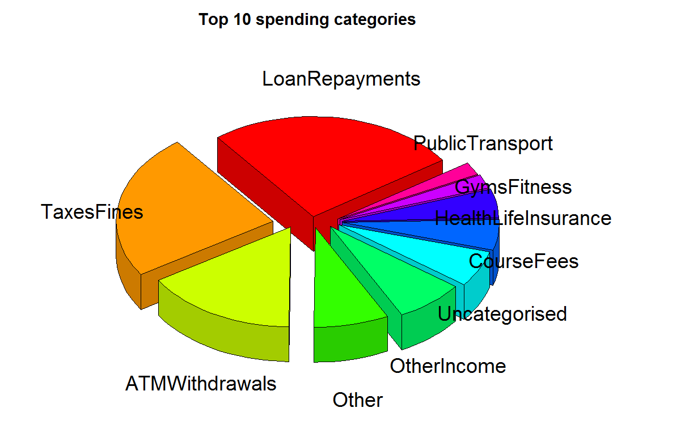

This is the start of a series of blog posts where I try to build an online personal budgeting system.

The motivation for this was me trying to do a household budget using existing tools (Pocketbook, CashDesk, QuickBooks, Xero).

Each time I needed to classify a large number of transactions manually (except Pocketbook they have got a pretty good classification engine)

As I do lots of transfer between accounts the summaries never made sense.  So I thought Id give it a go to build my own personal finance budgeter.

## Goals

- Discover the Who, What When, Where, Why and How a money transaction occurred purely from the metadata
- Website that allows users to connect/upload their bank accounts
- Connect to a users bank account using [bankstatements.com.au](https://bankstatements.com.au) / [basiq.io](https://basiq.io "https://basiq.io") (hoping to switch to Open Banking OAuth when available)
- Classify bank statements into categories & sub categories
- Summarise personal finances and display to a consumable way
- Predict spend over time & necessary budgeting
- Find savings / tax deductions (mortgage, insurance etc)

## The code for this solution is hosted on GitHub

[https://github.com/chrismckelt/vita](https://github.com/chrismckelt/vita "https://github.com/chrismckelt/vita") 

* * *

## Posts in this series

[Charge Id – scratching the tech itch \[ part 1 \]](/blog/?p=460)

[Charge Id – lean canvas \[ part 2 \]](/blog/?p=485)

[Charge Id – solution overview \[ part 3 \]](/blog/?p=505)

[Charge Id – analysing the data \[ part 4 \]](/blog/?p=507)

[Charge Id – the prediction model \[ part 5 \]](/blog/?p=668)

[Charge Id – deploying a ML.Net Model to Azure \[ part 6 \]](/blog/?p=705)

## Code

[https://github.com/chrismckelt/vita](https://github.com/chrismckelt/vita "https://github.com/chrismckelt/vita")

 

* * *
