# Series

[Part 1 - dotnet vs python vs node - temperature emission - who is cooler?](https://dev.to/chris_mckelt/azure-iot-edge-who-is-cooler-dotnet-node-or-python-369m)  
[Part 2 - Developing modules](https://dev.to/chris_mckelt/azure-iot-edge-developing-custom-modules-df3)  
[Part 3 - Custom Containers using Apache Nifi](https://dev.to/chris_mckelt/azure-iot-edge-3rd-party-containers-3mi3)  
[Part 4 - Custom Module using TimescaleDB](https://dev.to/chris_mckelt/azure-iot-edge-using-timescaledb-on-the-edge-2ec1)  
[Part 5 - Custom Module using Grafana](https://dev.to/chris_mckelt/azure-iot-edge-using-grafana-on-the-edge-26na)

# Intro

This is part 3 in a series starting [here](https://dev.to/chris_mckelt/azure-iot-edge-who-is-cooler-dotnet-node-or-python-369m) that runs through building an [Azure IOT Edge](https://docs.microsoft.com/en-us/azure/iot-edge/about-iot-edge) solution. This post will run through setting up a 3rd party docker container for an edge deployment.   
The code is located at: [https://github.com/chrismckelt/edgy](https://github.com/chrismckelt/edgy)

In order to manage data flow & logic on the edge we will deploy a data orchestrator.  There are quite a few [choices](https://stackshare.io/apache-nifi/alternatives) on the market – for this demo we will use Apache Nifi [https://nifi.apache.org/](https://nifi.apache.org/).

[Apache Nifi](https://nifi.apache.org/) describes itself as ‘_An easy to use, powerful, and reliable system to process and distribute data_.’

#### What will this module do?

The Nifi module will listen to the dot net, python & node module messages and when a temperature exceeds 25°C it will publish a message to activate the air conditioning.  The over heating module will receive the message and turn the air conditioning on, thus decrease the temperature.

[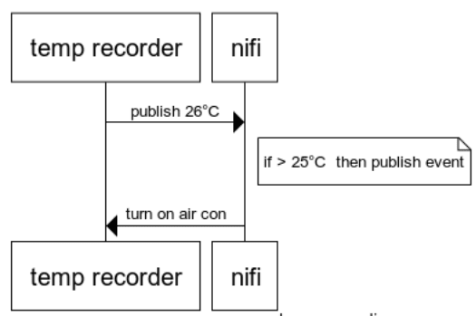](https://res.cloudinary.com/practicaldev/image/fetch/s--m-n00mc_--/c_limit%2Cf_auto%2Cfl_progressive%2Cq_auto%2Cw_880/https://user-images.githubusercontent.com/662868/78258726-3963ab00-752e-11ea-91fa-90ff4d0e13a7.png)

This work was inspired by the following project:  
[https://github.com/iotblackbelt/nifimodule](https://github.com/iotblackbelt/nifimodule)

### Setting up Nifi

To connect Nifi to the edge hub MQTT/AMQP broker (and not using the inbuilt [SDKs](https://docs.microsoft.com/en-us/azure/iot-hub/iot-hub-devguide-sdks) with code), we need to authenticate with self signed certificates.

The easiest way to use self signed certificates for Azure IoT Edge is to follow this tutorial [https://docs.microsoft.com/en-us/azure/iot-edge/tutorial-machine-learning-edge-05-configure-edge-device](https://docs.microsoft.com/en-us/azure/iot-edge/tutorial-machine-learning-edge-05-configure-edge-device).

I use the docker image provided in that tutorial to generate my self signed certs. After following the tutorial I upload the ROOT CA to the Azure IoT Hub. After verification it should appear as below:

[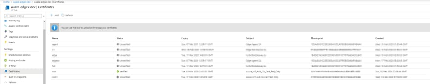](https://res.cloudinary.com/practicaldev/image/fetch/s--8duHmcbH--/c_limit%2Cf_auto%2Cfl_progressive%2Cq_auto%2Cw_880/https://user-images.githubusercontent.com/662868/78261684-1a671800-7532-11ea-932b-eda711d33355.png)

When working **locally** with the simulator you will use the generated certs from VS Code. These are found at _C:\\ProgramData\\iotedgehubdev_

[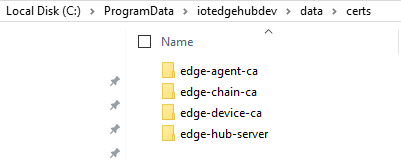](https://res.cloudinary.com/practicaldev/image/fetch/s--i60s7EvV--/c_limit%2Cf_auto%2Cfl_progressive%2Cq_auto%2Cw_880/https://user-images.githubusercontent.com/662868/78262241-dfb1af80-7532-11ea-82a1-d25141004479.png)

#### Deployment files

For debugging purposes I made a deployment file that runs only the _DotNetGenerator_ & _Nifi_.   The sections below are also in the full local debug and production template.[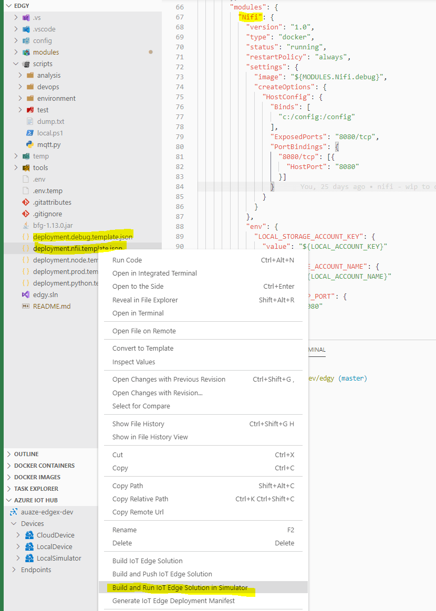](https://res.cloudinary.com/practicaldev/image/fetch/s--qsmDNdBq--/c_limit%2Cf_auto%2Cfl_progressive%2Cq_auto%2Cw_880/https://user-images.githubusercontent.com/662868/78413894-1c24fe80-764c-11ea-8bd6-0d4fbea22bad.png)

#### Nifi config setup

When the Nifi docker file starts it will execute a [script](https://github.com/chrismckelt/edgy/blob/master/modules/Nifi/local.sh) to do the following:

1. copy existing files from the local computer using docker bind from c:/config  to /config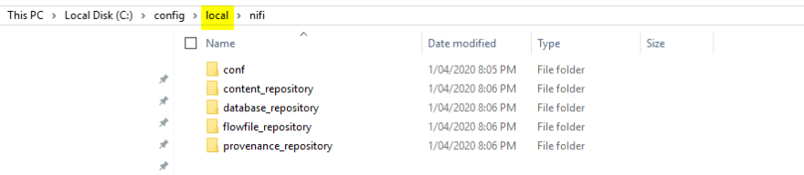
2. copy the self signed certificates to the Java cert store
3. restart Nifi so the certs and new configuration apply

#### Nifi authentication

To connect and publish messages to the MQTT broker we add the following processors in our Nifi flow

- ConsumeMQTT
- PublishMQTT

[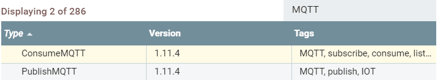](https://res.cloudinary.com/practicaldev/image/fetch/s--8B39VofP--/c_limit%2Cf_auto%2Cfl_progressive%2Cq_auto%2Cw_880/https://user-images.githubusercontent.com/662868/78415336-b3da1b00-7653-11ea-8704-90bfe2007a5a.png)

Upon adding a processor you will need to enter the connection details and configure a _SSL Context Service_  to connect to the edge hub broker.

[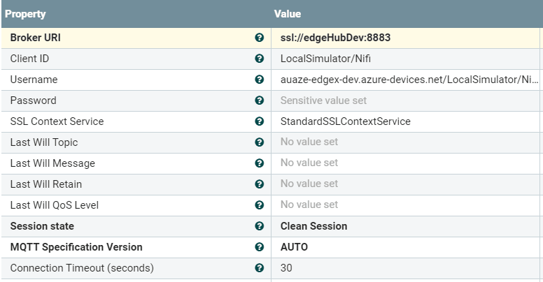](https://res.cloudinary.com/practicaldev/image/fetch/s--nw1I_S7q--/c_limit%2Cf_auto%2Cfl_progressive%2Cq_auto%2Cw_880/https://user-images.githubusercontent.com/662868/78415309-7bd2d800-7653-11ea-8683-ff076cd14baf.png)

###### SSL Context Service setting (certs used are stored in the Java cert store)

[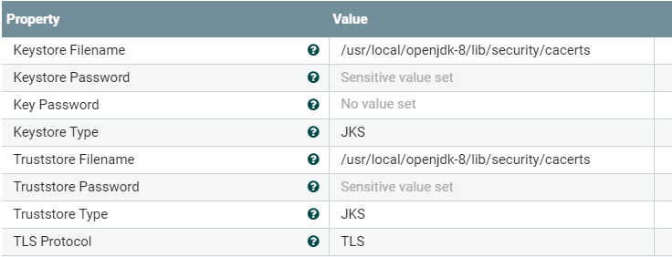](https://res.cloudinary.com/practicaldev/image/fetch/s--088Jx9uQ--/c_limit%2Cf_auto%2Cfl_progressive%2Cq_auto%2Cw_880/https://user-images.githubusercontent.com/662868/78415387-fac81080-7653-11ea-8d80-4f8fbdb1307b.png)

###### Settings

[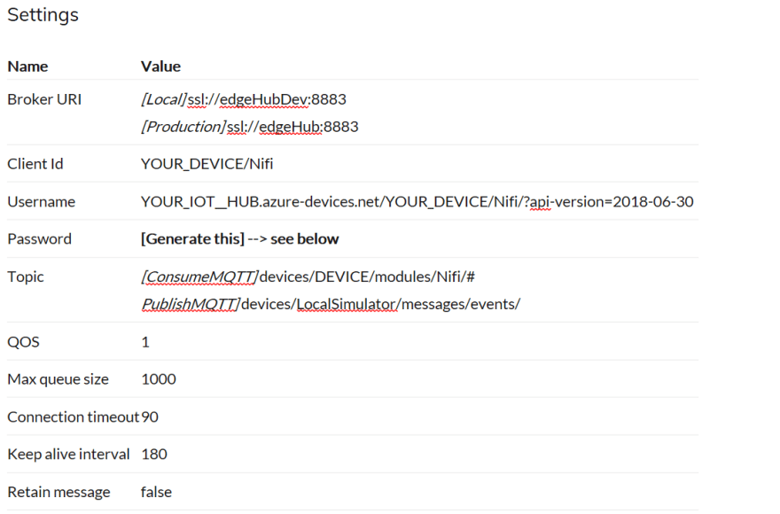](https://res.cloudinary.com/practicaldev/image/fetch/s--DP2tsLYO--/c_limit%2Cf_auto%2Cfl_progressive%2Cq_auto%2Cw_880/https://user-images.githubusercontent.com/662868/78469090-5bd50e80-7750-11ea-8222-b22a6d8947c8.png)

###### To generate a SAS token, right click on the device and select ‘Generate SAS Token for Device’

###### 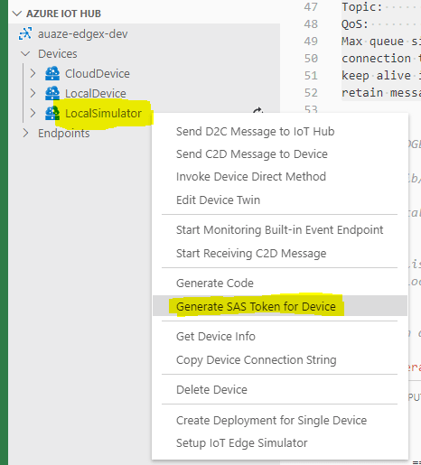

#### Nifi logic to air con control

Using the inbuilt IoT routing system temperature payloads published from dot net, python & node will be pushed to Nifi.

[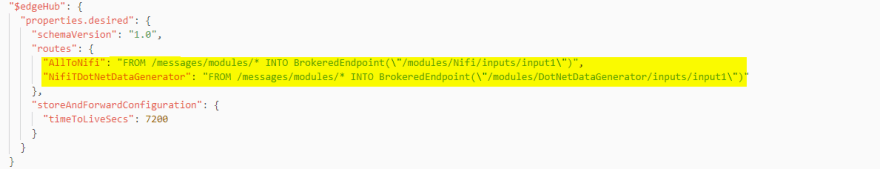](https://res.cloudinary.com/practicaldev/image/fetch/s--AME5Gc1u--/c_limit%2Cf_auto%2Cfl_progressive%2Cq_auto%2Cw_880/https://user-images.githubusercontent.com/662868/78415724-4aa7d700-7656-11ea-9047-1d3f03e01ca8.png)

Nifi checks if the temperature recording exceeds 25°C.  When this occurs it will publish its own message which is routed back to the overheating module requesting it to turn on the air con.

[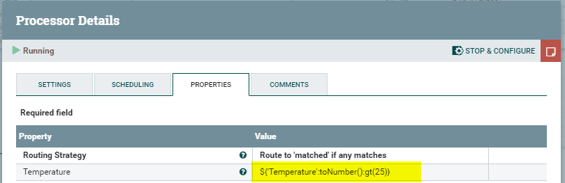](https://res.cloudinary.com/practicaldev/image/fetch/s--MfFqHGQJ--/c_limit%2Cf_auto%2Cfl_progressive%2Cq_auto%2Cw_880/https://user-images.githubusercontent.com/662868/78273205-1989b280-7541-11ea-92c4-eb9f92153fa2.png)

In Nifi this translates to the following processor flows (probably a better way to do this – Nifi experts?)

#### Nifi flows

[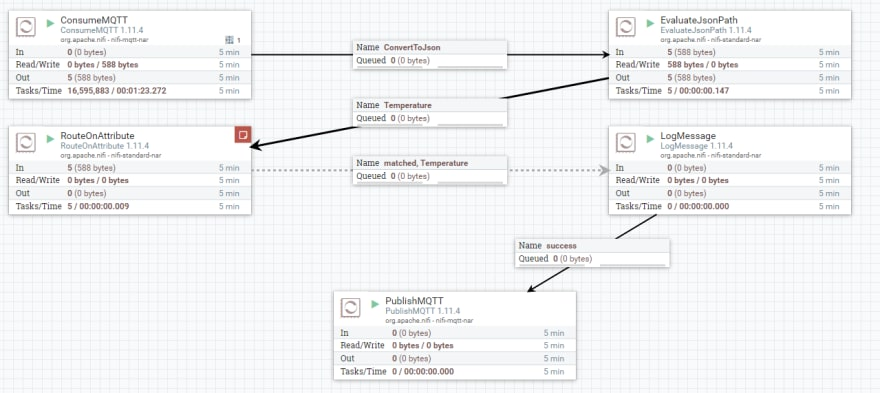](https://res.cloudinary.com/practicaldev/image/fetch/s--eGBp_KdD--/c_limit%2Cf_auto%2Cfl_progressive%2Cq_auto%2Cw_880/https://user-images.githubusercontent.com/662868/78217920-85432f80-74ef-11ea-80db-e92bd4f2b850.png)

#### Running the solution locally

Upon starting the solution each module will publish a temperature starting at 20°C .   Nifi will receive each message via the Consume MQTT processor.  Viewing the data provenance shows all received messages:[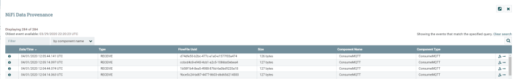](https://res.cloudinary.com/practicaldev/image/fetch/s--Z5jFn1JZ--/c_limit%2Cf_auto%2Cfl_progressive%2Cq_auto%2Cw_880/https://user-images.githubusercontent.com/662868/78442149-d8151680-76aa-11ea-9f33-504390a7487b.png)

The modules keep publishing increasing temperatures until Nifi received a temperature over 25°C.  Nifi then publishes a message requesting the respective module (e.g. _PythonDataGenerator_) to decrease the temperature (turn on the air con).

[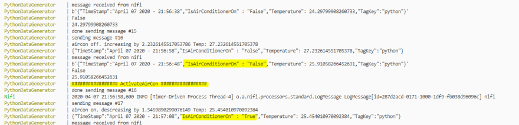](https://res.cloudinary.com/practicaldev/image/fetch/s--fGq9xMoT--/c_limit%2Cf_auto%2Cfl_progressive%2Cq_auto%2Cw_880/https://user-images.githubusercontent.com/662868/78723470-0e2df100-795e-11ea-8ebf-75294a7beb1c.png)

#### Watch out when publishing your container to ACR

Be careful when publishing your local containers to your remote container registry.  I was publishing direct from my machine to my Azure Container Registry. Meanwhile the environment variables were set to look for certificates in the wrong place. So Nifi would not authenticate.

#### 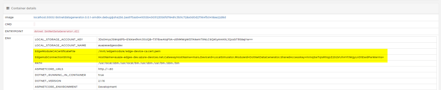

### Outro

Here we have shown how to build and deploy a 3rd party container in our edge solution.  Once we have the installed the custom certificates Nifi can authenticate to the edge hub and send/receive messages.
