# Intro

Here is a quick way to setup a new WordPress blog with a custom domain on Azure (optionally using [free using credits](https://azure.microsoft.com/en-au/free)).

This was used to setup the blog you are reading: [**TakesInsight.com**](http://TakesInsight.com)

### Azure Resources Overview

Resources used to setup the blog may be seen below. These were created within a single resource group called ‘blog’

[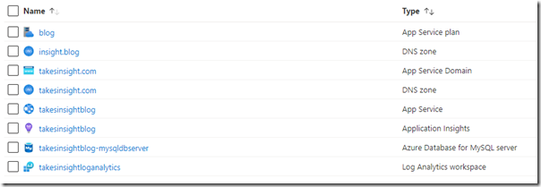](http://blog.mckelt.com/https://raw.githubusercontent.com/chrismckelt/chrismckelt.github.io/master/_posts/posts/images//2021/01/1-resource-group-view.png)

## WordPress Setup

> 1\. After logging into Azure go the the [marketplace](https://portal.azure.com/?quickstart=true) and search for WordPress

[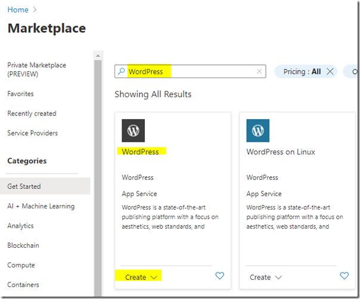](http://blog.mckelt.com/https://raw.githubusercontent.com/chrismckelt/chrismckelt.github.io/master/_posts/posts/images//2021/01/2-wordpress-marketplace.png)

> 2\. Click _create_ and begin to enter the details for your blog.  All resources below were created in a new resource group called ‘_blog’_

[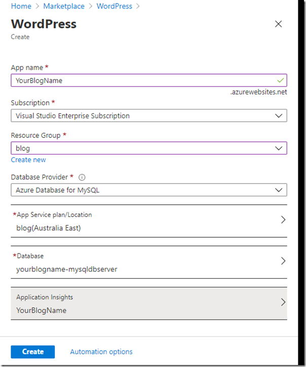](http://blog.mckelt.com/https://raw.githubusercontent.com/chrismckelt/chrismckelt.github.io/master/_posts/posts/images//2021/01/3-create-from-marketplace.png)

> 3\. Create a new _App Service Plan_
> 
> _[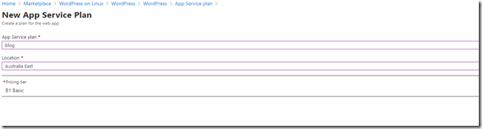](http://blog.mckelt.com/https://raw.githubusercontent.com/chrismckelt/chrismckelt.github.io/master/_posts/posts/images//2021/01/2-new-app-service-plan.png)_
> 
> Here we are using the cheapest pricing tier that allows a custom domain: ‘B1 Basic’ Tier
> 
> [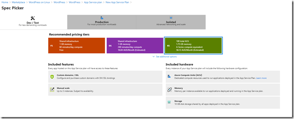](http://blog.mckelt.com/https://raw.githubusercontent.com/chrismckelt/chrismckelt.github.io/master/_posts/posts/images//2021/01/spec-picker.png)
> 
> 4\. Configure a new database server using the ‘Basic’ pricing tier
> 
> [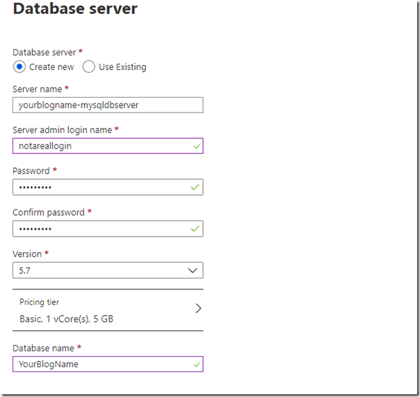](http://blog.mckelt.com/https://raw.githubusercontent.com/chrismckelt/chrismckelt.github.io/master/_posts/posts/images//2021/01/database-server.png)
> 
> [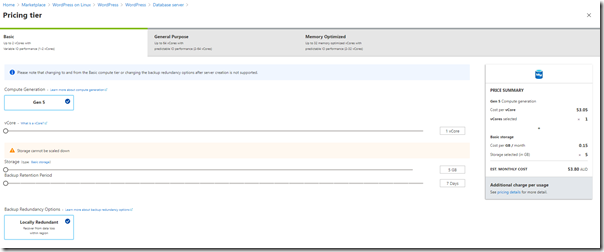](http://blog.mckelt.com/https://raw.githubusercontent.com/chrismckelt/chrismckelt.github.io/master/_posts/posts/images//2021/01/pricing-tier.png)
> 
> 5\. After clicking the create button a new WordPress App Service will be deployed and available to configure on _YourBlogSite.azurewebsites.net_
> 
> Navigate to the website and configure your WordPress instance.
> 
> [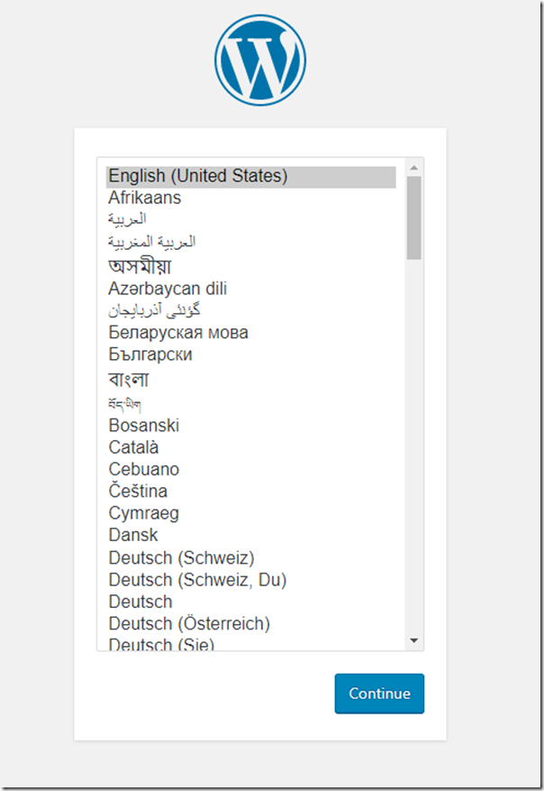](http://blog.mckelt.com/https://raw.githubusercontent.com/chrismckelt/chrismckelt.github.io/master/_posts/posts/images//2021/01/english.png)
> 
> 6\. Next we will setup a custom website domain to use for the blog using [App Service Domains](https://docs.microsoft.com/en-us/azure/app-service/manage-custom-dns-buy-domain).  
> App Service domains are custom domains that are managed directly in Azure. They make it easy to manage custom domains for [Azure App Service](https://docs.microsoft.com/en-us/azure/app-service/overview).
> 
> [Create your App Service Domain](https://portal.azure.com/?quickstart=true#create/Microsoft.Domain) and choose a TLD domain name for your website.
> 
> [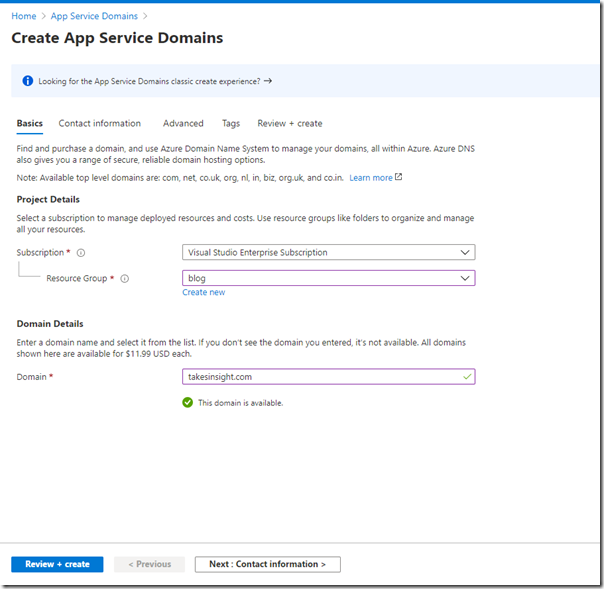](http://blog.mckelt.com/https://raw.githubusercontent.com/chrismckelt/chrismckelt.github.io/master/_posts/posts/images//2021/01/create-app-services-domain-1.png)
> 
> 7\. Enter your contact information required by GoDaddy for domain registration and Azure DNS to host the domains. In addition to the yearly domain registration fee, usage charges for Azure DNS apply. For information, see Azure DNS Pricing.
> 
> [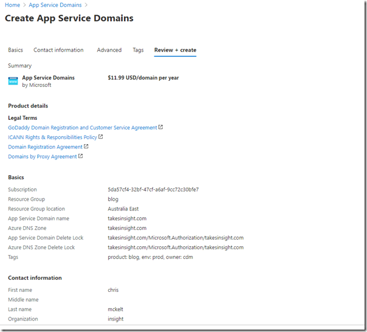](http://blog.mckelt.com/https://raw.githubusercontent.com/chrismckelt/chrismckelt.github.io/master/_posts/posts/images//2021/01/create-app-services-domain-2.png)
> 
> 8\. Create you App Service Domain, it may take a while for the DNS to propagate and be ready for use
> 
> [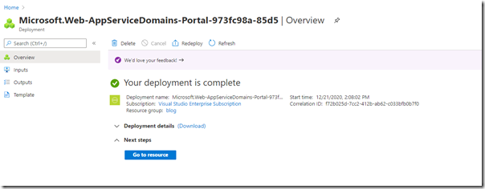](http://blog.mckelt.com/https://raw.githubusercontent.com/chrismckelt/chrismckelt.github.io/master/_posts/posts/images//2021/01/app-service-domain-deployment-2.png)
> 
> 9\. Go to your App Service Domain and add a hostname binding pointing to the App Service that hosts your WordPress blog.
> 
> [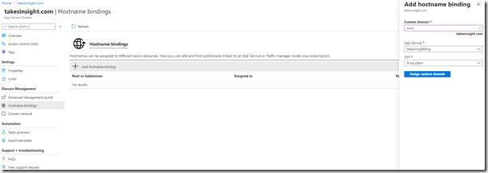](http://blog.mckelt.com/https://raw.githubusercontent.com/chrismckelt/chrismckelt.github.io/master/_posts/posts/images//2021/01/hostname-bindings.png)
> 
> 10\. You should now be able to browse to your custom domain and see your WordPress site. Thats it!
> 
> # Conclusion
> 
> So we now have a WordPress website setup with a custom domain without leaving the Azure portal.
> 
> Next steps will be:
> 
> - Create a free SSL certificate via Lets Encrypt to host the site under SSL
> - Follow Azure guidelines to [improve](https://techcommunity.microsoft.com/t5/azure-database-for-mysql/improving-your-wordpress-workloa-performance-on-azure-database/ba-p/1418717) WordPress performance
> 
> Please let us know how you go with setting up your own site.
> 
> Happy blogging!
